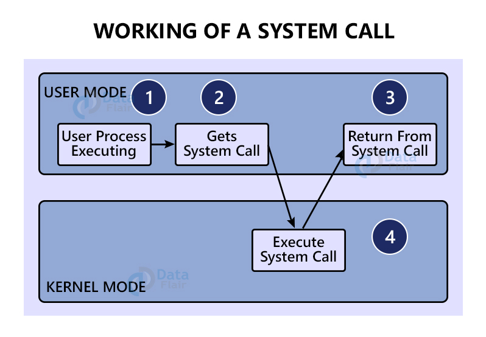

# What is a system call?

[Source](https://data-flair.training/blogs/system-call-in-os/)

System call is an api that

- 우리가 사용하는 시스템 콜의 예시를 들어주세요.
  open, read, write, close for managing file operatoins
  wait, exec, fork, exit, kill for handling process control

- 시스템 콜이 운영체제에서 어떤 과정으로 실행되는지 설명해 주세요.

  1. System Call invocation
  2. Context Switch

     The CPU switches from user mode to kernel mode, saving the current state

  3. Kernel Mode Activation

     The OS executes the requested service with full hardware access

  4. Return to User Mode

     After completing the service, the system switches back to user mode, restorin the previous state

- 시스템 콜의 유형에 대해 설명해 주세요.
  1. Process Control
     - fork: create a new process by duplicating the calling process
     - exit: Terminate the calling process
     - kill: Send a signal to a process, often used to terminate it
     - exec: Replace the current process image with a new one
     - wait: Make the parent process wait until one of its children terminates
  2. File Management
     - creat: Create a new file
     - delete: Remove a file
     - open
     - close
     - read: Read data from a file
     - write: Write data to a file
  3. Device Management
     - ioctl: Control device parameters
     - read: Read data from a device
     - write: Write data to a device
  4. Information Maintencance
     - getpid
     - alarm: Set an alarm clock for delivery of a signal after a specified time
     - sleep: Suspend the execution of the calling process for a specified time
  5. Communication
     - pipe: Create a pipe for unidirectional data flow between processes
     - shmget: Allocate a shared memory segment
     - mmap: Map files or devices into memory, often used for shared memory
  6. Protection
- 운영체제의 Dual Mode 에 대해 설명해 주세요.

  1. User Mode

     A restricted mode where user applications operate with limited access to system resources, preventing accidental or malicious interference with critcal system operations.

  2. Kernel Mode

     A privileged mode where the operating system has unrestricted access to all system resources, allowing it to perform essential tasks such as hardware management and process scheduling.

- 왜 유저모드와 커널모드를 구분해야 하나요?

  1. Security

     Protects the system from unauthorized access and potential malicious activities by lmiting the capabilities of user applications

  2. Stability

     Prevents user applications from directly interacting with hardware or critical system components, reducing the risk of system crashes

  3. Abstraction

     Provides a controlled interface for user applications to access hardware resources, simplifying application development and enhancing portability.

- 서로 다른 시스템 콜을 어떻게 구분할 수 있을까요?
  System calls are typically identified by their unique names and associated functionalities.
